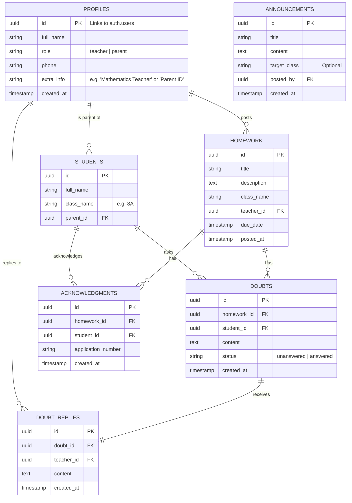

# Supabase Backend Implementation Plan

This plan outlines the database schema, security policies, and integration strategy for moving the SchoolGrid Central application from local state management to a Supabase backend.

## Proposed Supabase Schema

### Tables & Relationships

### Data Types Mapping

| Supabase/PostgreSQL | Dart Type | Usage |
|---------------------|-----------|-------|
| `uuid` | `String` | Primary & Foreign Keys |
| `text` / `varchar` | `String` | Titles, Names, Descriptions |
| `timestamp with time zone` | `DateTime` | Dates and Timestamps |
| `boolean` | `bool` | Flags |
| `jsonb` | `Map` | Complex objects (if needed) |

## Security & Row Level Security (RLS)

Supabase RLS policies will ensure data privacy:
- **Homework**: Visible to all authenticated users; only teachers can `INSERT`.
- **Doubts**: Only students (or their parents) can `INSERT`; only teachers can `UPDATE` (via replies).
- **Profiles**: Authenticated users can read; users can only update their own profile.
- **Students**: Parents can only see their own children.

## Implementation Steps

### 1. Supabase Setup
- Create a new project in Supabase dashboard.
- Execute SQL commands to create the tables above.
- Enable RLS for all tables.

### 2. Flutter Integration
- Add `supabase_flutter` dependency to [pubspec.yaml](file:///c:/Users/jeeva%20bharathi/OneDrive/Desktop/flutter_mobile%20app/flutter_app/pubspec.yaml).
- Initialize Supabase in [main.dart](file:///c:/Users/jeeva%20bharathi/OneDrive/Desktop/flutter_mobile%20app/flutter_app/lib/main.dart).
- Replace [HomeworkService](file:///c:/Users/jeeva%20bharathi/OneDrive/Desktop/flutter_mobile%20app/flutter_app/lib/core/services/homework_service.dart#5-160) logic with Supabase client calls.
- Update [LoginScreen](file:///c:/Users/jeeva%20bharathi/OneDrive/Desktop/flutter_mobile%20app/flutter_app/lib/features/auth/login_screen.dart#5-12) and [SignUpScreen](file:///c:/Users/jeeva%20bharathi/OneDrive/Desktop/flutter_mobile%20app/flutter_app/lib/features/auth/signup_screen.dart#5-12) to use Supabase Auth.

### 3. Migration
- Migrate existing mock data into Supabase (optional for development).
- Update UI components to handle `StreamBuilder` or `future` states for real-time updates.

## Verification Plan

### Automated Tests
- Run `flutter test` with mocked Supabase client.
- Test Auth flows (Sign Up -> Login -> Protected Route).

### Manual Verification
- Post a homework as a Teacher and verify it appears on the Parent's home screen.
- Submit a doubt as a Parent and verify the Teacher sees a notification and can reply.
- Acknowledge a homework and verify the count updates in real-time.
